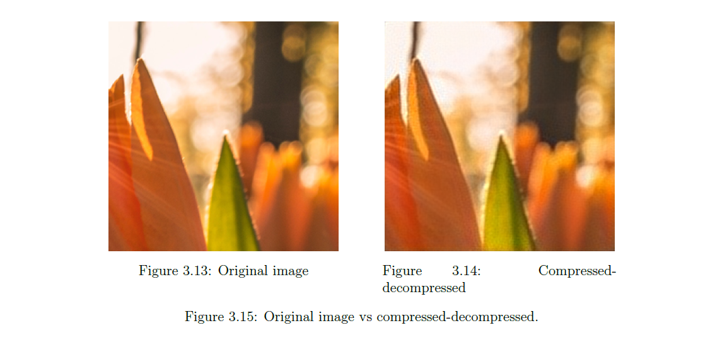

# Image Compression Using Deep Convolutional Neural Networks

This repository contains the implementation of an image compression project developed as part of my Master’s thesis. The project uses deep convolutional neural networks to compress and decompress high-resolution images, aiming to achieve high-quality reconstruction with minimal data size.

---

## Repository Structure

- training.ipynb  (training notebook)
- testing.ipynb   (testing notebook)
- checkpoints/     (saved model weights)
- Master_Thesis.pdf
- README.md        (this file)

---

## Libraries Used

This project uses the following main Python libraries:

- `torch` and `torch.nn` for building and training the neural networks  
- `torchvision` for data transformations  
- `numpy` for numerical operations  
- `opencv-python` (`cv2`) for image processing  
- `PIL` for image loading  
- `argparse`, `pathlib`, `glob`, and standard Python libraries for utility functions

---

## Dataset

The primary dataset used is **DIV2K** for training and evaluation, along with some additional custom images. Please download the DIV2K dataset separately from the official source [DIV2K dataset](https://data.vision.ee.ethz.ch/cvl/DIV2K/) and place it in the appropriate folder for training.

---

## How to Use

1. **Training**:  
   Open and run the `notebooks/training.ipynb` notebook to train the compression model. The notebook includes all the necessary steps such as dataset loading, model definition, training loop, and saving checkpoints.

2. **Testing**:  
   Use `notebooks/testing.ipynb` to load a trained model checkpoint and evaluate its performance on test images. The notebook also includes visualization of original vs compressed images and calculation of quality metrics like PSNR and MSE.

---

## Results

The model achieves promising compression and reconstruction results on the DIV2K dataset, as detailed in the thesis document. Example outputs, PSNR, and MSE values are shown in the testing notebook.
Here is an example of original vs reconstructed images:

---

## Master Thesis

The full thesis document describing the project motivation, methodology, experiments, and conclusions is included in the `thesis/` folder as `Master_Thesis.pdf`.

---

## License

This project is licensed under the MIT License — see the LICENSE file for details.

---

## Contact

For questions or suggestions, feel free to contact me at:  
**abdellah.zerabib@gmail.com**

---
## Contributors

- Abdellah Zerabib (Main developer)
- Hammi Nadje Eddine (Main developer)

